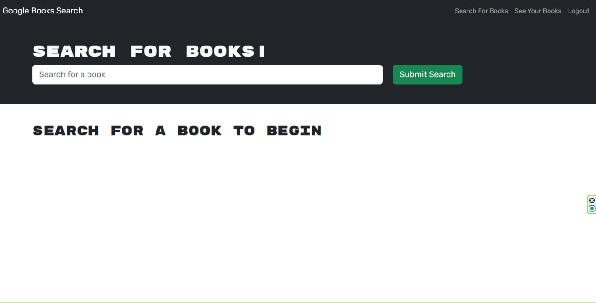
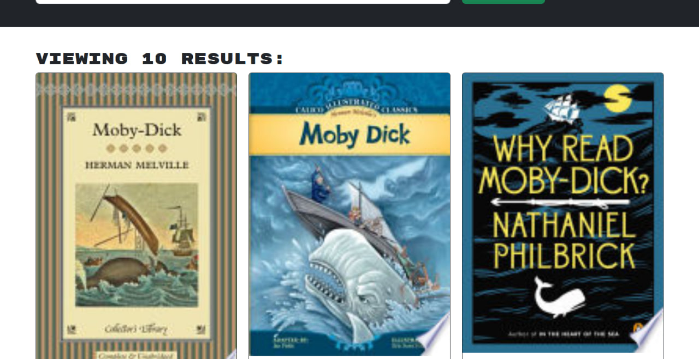
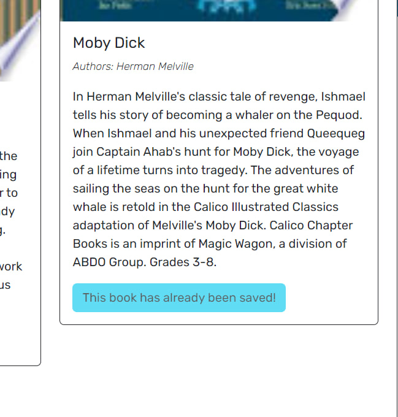
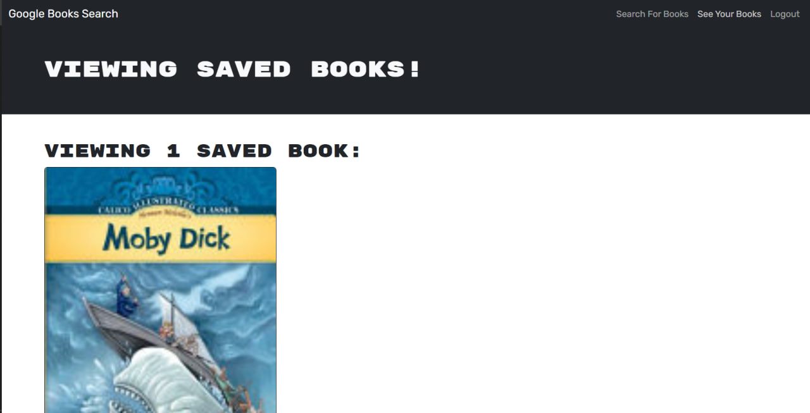

# Book-Shelves

Project to change routes to queries and mutations

## Description

In this project I wanted to change original code of looking for data through routes and controller to quiries and mutations. I changed server code and how front end connect to MangoDB and client side code how front end app retrieve information from Data Base.

## Table of Contets

- [Screenshots](#screenshots)
- [Links](#links)

## Screenshots

In this section I provided screenshots of live web application

## Links

In this section I added links to the Live Application and to the GitHub repository of the original code base and modified code.

Live App:
https://main--bookshelveextra.netlify.app/Links to an external site.

Modified GitHub Code Repository:
https://github.com/MykhailoZakh/Book-ShelvesLinks to an external site.

Original Code Repository:
https://github.com/coding-boot-camp/solid-broccoli
